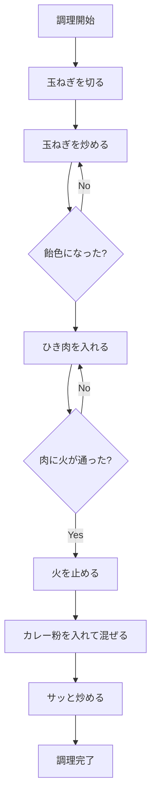

## キーマカレーの作り方

- 調理開始！
- 玉ねぎを切る
- (ピーマンなど季節の野菜がある場合) 野菜を切る
- 玉ねぎを炒める（飴色になるまでループ）
- 野菜を入れ、さらに炒める（全体的に火が通るなるまでループ）(野菜がある場合)
- ひき肉を入れ、さらにに炒める（肉の赤いところに火が通るまでループ）
- 火を止め、カレー粉を入れ混ぜる
- サッと炒める
- 調理完了

```mermaid
flowchart TD
    A[調理開始] --> B[玉ねぎを切る]
    E[玉ねぎを炒める]
    E --> F{飴色になった?}
    F -->|No| E
    I[ひき肉を入れる]
    I --> J{肉に火が通った?}
    J -->|No| I
    J -->|Yes| K[火を止める]
    K --> L[カレー粉を入れて混ぜる]
    L --> M[サッと炒める]
    M --> N[調理完了]
    B --> E
    F --> I
```
