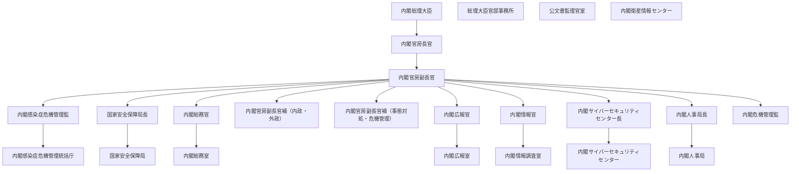

```mermaid
graph TD
    A["内閣総理大臣"] --> B["内閣官房長官"]
    B --> C["内閣官房副長官"]
    
    D["内閣感染症危機管理監"] --> E["内閣感染症危機管理統括庁"]
    
    F["国家安全保障局長"] --> G["国家安全保障局"]
    
    H["内閣総務官"] --> I["内閣総務室"]
    
    J["内閣官房副長官補（内政・外政）"]
    
    K["内閣官房副長官補（事態対処・危機管理）"]
    
    L["内閣広報官"] --> M["内閣広報室"]
    
    N["内閣情報官"] --> O["内閣情報調査室"]
    
    P["内閣サイバーセキュリティセンター長"] --> Q["内閣サイバーセキュリティセンター"]
    
    R["内閣人事局長"] --> S["内閣人事局"]
    
    T["内閣危機管理監"]
    
    U["総理大臣官邸事務所"]
    V["公文書監理官室"]
    W["内閣衛星情報センター"]
    
    C --> D
    C --> F
    C --> H
    C --> J
    C --> K
    C --> L
    C --> N
    C --> P
    C --> R
    C --> T
```
